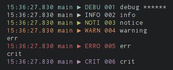

<h1 align="center">
  <br>Logger<br>
</h1>

[](https://godoc.org/github.com/telanflow/logger)

Package logger implements a logging infrastructure for Go. Its output format
is customizable and supports different logger backends like syslog, file and
memory. Multiple backends can be utilized with different log levels per backend
and logger.

Fork by [go-logging](https://github.com/op/go-logging)

## Example

Let's have a look at an [example](examples/example.go) which demonstrates most
of the features found in this library.

[](examples/example.go)

```go
package main

import (
	"os"

	"github.com/telanflow/logger"
)

var log = logger.MustGetLogger("example")

// Example format string. Everything except the message has a custom color
// which is dependent on the log level. Many fields have a custom output
// formatting too, eg. the time returns the hour down to the milli second.
var format = logger.MustStringFormatter(
	`%{color}%{time:15:04:05.000} %{shortfunc} ▶ %{level:.4s} %{id:03x}%{color:reset} %{message}`,
)

// Password is just an example type implementing the Redactor interface. Any
// time this is logged, the Redacted() function will be called.
type Password string

func (p Password) Redacted() interface{} {
	return logger.Redact(string(p))
}

func main() {
	// For demo purposes, create two backend for os.Stderr.
	backend1 := logger.NewLogBackend(os.Stderr, "", 0)
	backend2 := logger.NewLogBackend(os.Stderr, "", 0)

	// For messages written to backend2 we want to add some additional
	// information to the output, including the used log level and the name of
	// the function.
	backend2Formatter := logger.NewBackendFormatter(backend2, format)

	// Only errors and more severe messages should be sent to backend1
	backend1Leveled := logger.AddModuleLevel(backend1)
	backend1Leveled.SetLevel(logger.ERROR, "")

	// Set the backends to be used.
	logger.SetBackend(backend1Leveled, backend2Formatter)

	log.Debugf("debug %s", Password("secret"))
	log.Info("info")
	log.Notice("notice")
	log.Warning("warning")
	log.Error("err")
	log.Critical("crit")
}
```

## Installing

### Using *go get*

    $ go get github.com/telanflow/logger

After this command *logger* is ready to use. Its source will be in:

    $GOPATH/src/pkg/github.com/telanflow/logger

You can use `go get -u` to update the package.

## 📄 License
Source code in `Logger` is available under the [BSD 3 License](/LICENSE).